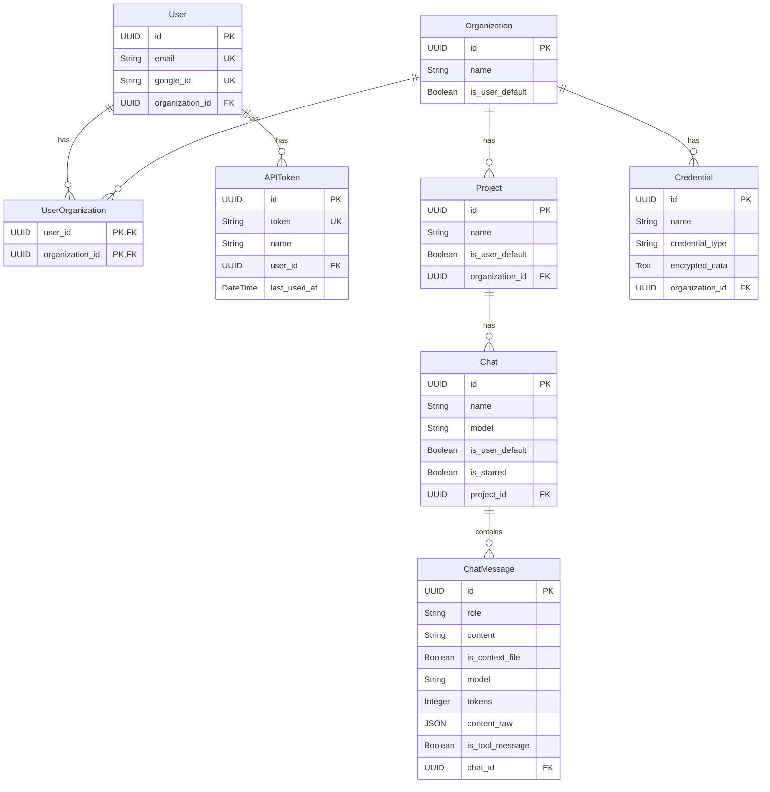

# Platform

Current Platform Schema

```mermaid
erDiagram
    User ||--o{ UserOrganization : has
    User ||--o{ APIToken : has
    Organization ||--o{ UserOrganization : has
    Organization ||--o{ Project : has
    Organization ||--o{ Credential : has
    Project ||--o{ Chat : has
    Chat ||--o{ ChatMessage : contains

    User {
        UUID id PK
        String email UK
        String google_id UK
        UUID organization_id FK
    }

    Organization {
        UUID id PK
        String name
        Boolean is_user_default
    }

    UserOrganization {
        UUID user_id PK,FK
        UUID organization_id PK,FK
    }

    Project {
        UUID id PK
        String name
        Boolean is_user_default
        UUID organization_id FK
    }

    Chat {
        UUID id PK
        String name
        String model
        Boolean is_user_default
        Boolean is_starred
        UUID project_id FK
    }

    ChatMessage {
        UUID id PK
        String role
        String content
        Boolean is_context_file
        String model
        Integer tokens
        JSON content_raw
        Boolean is_tool_message
        UUID chat_id FK
    }

    Credential {
        UUID id PK
        String name
        String credential_type
        Text encrypted_data
        UUID organization_id FK
    }

    APIToken {
        UUID id PK
        String token UK
        String name
        UUID user_id FK
        DateTime last_used_at
    }
```
